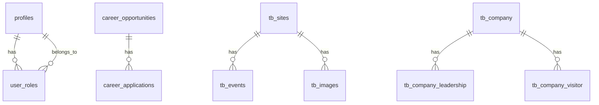

# Entity-Relationship Diagram (ERD)

This document describes the main data models (entities) and their relationships in the Heritage Museum Platform.

---

## Main Entities

- **profiles**: User profile information
- **user_roles**: User roles (admin, editor, viewer, etc.)
- **banners**: Banner content for the site
- **news_articles**: News and articles
- **agenda_items**: Event agenda
- **museums**: Museum data
- **career_opportunities**: Job/internship opportunities
- **career_applications**: Applications for career opportunities
- **media_items**: Media content (images, files, etc.)
- **faqs**: Frequently asked questions
- **content_sections**: CMS content sections
- **tb_sites**: Heritage sites
- **tb_events**: Events at sites
- **tb_images**: Images for sites
- **tb_company**: Company/organization data
- **tb_company_leadership**: Company leadership
- **tb_company_visitor**: Company visitor statistics

---

## Key Relationships

- `user_roles.user_id` → `profiles.user_id`
- `career_applications.opportunity_id` → `career_opportunities.id`
- `tb_events.sites_id` → `tb_sites.id`
- `tb_images.sites_id` → `tb_sites.id`
- `tb_company_leadership.company_id` → `tb_company.id`
- `tb_company_visitor.company_id` → `tb_company.id`

---

## ERD Diagram (Mermaid)

---

## Notes

- All main tables support full CRUD operations.
- Additional fields and relationships exist; see the database schema for full details.
- Some tables (e.g., `tb_events`, `tb_sites`) have additional relationships (e.g., categories, types) not shown in this simplified ERD.