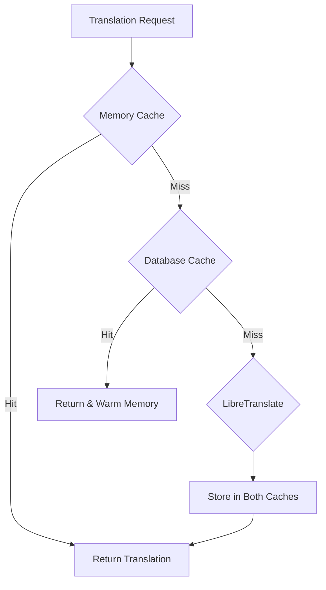

# Translation Performance Optimization Plan

## Current Performance Issues

**Problem**: Slow API responses for dynamic content translation using LibreTranslate

**Root Causes Identified**:
1. **Individual API Calls**: Each text translation makes a separate HTTP request to LibreTranslate
2. **No Batch Processing**: Multiple texts are translated sequentially instead of in batches
3. **Limited Caching**: Only basic in-memory caching with no persistent storage
4. **No Translation Memory**: Same texts are re-translated repeatedly
5. **Blocking Operations**: Translations block API responses
6. **No Pre-translation**: Common content is not pre-translated

## Optimization Strategy

### 1. Batch Translation API Endpoint
- Implement batch translation endpoint that accepts multiple texts in one request
- Reduce HTTP overhead from multiple individual requests
- Leverage LibreTranslate's batch processing capability

### 2. Enhanced Content Translation Service
- Add intelligent batching of translation requests
- Implement request deduplication for identical texts
- Add concurrent processing for multiple translations
- Implement smart retry logic with exponential backoff

### 3. Multi-Layer Caching Strategy


### 4. Redis Caching Layer
- Add Redis for fast in-memory caching
- Implement TTL (Time To Live) for cache entries
- Cache frequently translated content
- Implement cache warming for common texts

### 5. Translation Queue System
- Implement non-blocking translation queue
- Use Redis/BullMQ for job processing
- Return immediate response with translation status
- Process translations in background

### 6. Pre-translation System
- Identify common content patterns
- Pre-translate frequently accessed content
- Warm cache during application startup
- Schedule periodic cache warming

### 7. Translation Memory
- Store previously translated texts
- Reuse translations for identical content
- Implement fuzzy matching for similar texts
- Reduce API calls for repeated content

### 8. Database Optimization
- Add composite indexes for translation lookups
- Implement materialized views for common queries
- Optimize translation table structure
- Add database connection pooling

### 9. Smart Retry Logic
- Implement exponential backoff for failed translations
- Add circuit breaker pattern
- Monitor translation service health
- Fallback to original text on repeated failures

### 10. Performance Monitoring
- Add translation response time metrics
- Track cache hit/miss ratios
- Monitor LibreTranslate API health
- Set up alerts for performance degradation

## Implementation Priority

### Phase 1: Immediate Wins (High Impact, Low Effort)
1. **Batch Translation API** - Reduce HTTP overhead
2. **Enhanced Caching** - Improve cache hit rates
3. **Translation Memory** - Reuse existing translations

### Phase 2: Medium Term Improvements
4. **Redis Integration** - Add fast in-memory cache
5. **Database Optimization** - Improve query performance
6. **Smart Retry Logic** - Handle failures gracefully

### Phase 3: Advanced Optimizations
7. **Translation Queue** - Non-blocking operations
8. **Pre-translation System** - Proactive caching
9. **Performance Monitoring** - Continuous optimization

## Expected Performance Improvements

| Optimization | Expected Speedup | Impact |
|-------------|-----------------|---------|
| Batch Translation | 5-10x | High |
| Enhanced Caching | 3-5x | High |
| Translation Memory | 2-3x | Medium |
| Redis Integration | 2-3x | Medium |
| Database Optimization | 1.5-2x | Low |
| Queue System | 1.5x | Medium |

## Technical Implementation Details

### Batch Translation Endpoint
```typescript
POST /api/translate/batch
{
  "texts": ["text1", "text2", "text3"],
  "targetLang": "en",
  "sourceLang": "id"
}
```

### Enhanced Caching Strategy
- **Memory Cache**: Short-term (5 minutes)
- **Redis Cache**: Medium-term (1 hour)
- **Database Cache**: Long-term (24 hours)
- **Translation Memory**: Permanent

### Monitoring Metrics
- Translation response times
- Cache hit rates
- API success rates
- Queue processing times

## Next Steps

1. Switch to Code mode to implement batch translation endpoint
2. Enhance content translation service with batching
3. Add Redis caching layer
4. Implement translation memory
5. Add performance monitoring
6. Test and benchmark improvements

## Success Metrics
- Translation API response time < 500ms (currently 2-5 seconds)
- Cache hit rate > 80%
- Reduced LibreTranslate API calls by 70%
- Improved user experience with faster page loads